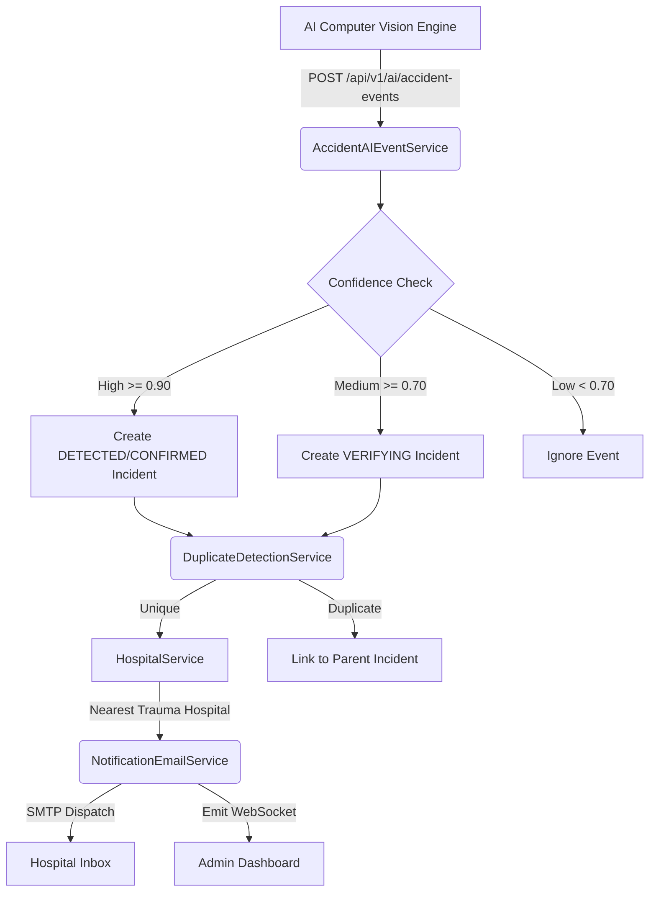

# Accident Response System — Architecture & Documentation

## Overview

The Accident Response System is a specialized module within the **CityPulse AI** platform. It processes real-time AI computer vision deductions (from CCTVs), isolates verified accident incidents, locates the nearest trauma-capable hospitals, and reliably dispatches hospital notifications in a fully automated life-cycle. 

This system integrates completely into the multi-city architecture, maintaining full isolation per city, integrating dynamically with other systems like NotificationEmailService, WebSocket broadcasts, and role-based access.

---

## Architecture Diagram



## Core Modules

### 1. **AccidentCamera**
Registers CCTVs configured to send data. 
- Maintains geographic location matching (`2dsphere` indexed).
- Status: `ONLINE`, `OFFLINE`, `DISABLED`, `ERROR`.

### 2. **AccidentHospital**
Registers connected healthcare facilities.
- Indexed by location allowing instantaneous Mongo `$near` query.
- Records capabilities (`emergencyAvailable`, `traumaFacility`).

### 3. **AccidentIncident**
Stores the complete state-machine lifecycle of an incident.
- **Statuses**: `DETECTED` → `VERIFYING` → `CONFIRMED` → `HOSPITAL_NOTIFIED` → `RESPONSE_IN_PROGRESS` → `HOSPITAL_RECEIVED` → `RESOLVED` / `FALSE_POSITIVE` / `CANCELLED`.
- Contains deeply nested evidence subdocuments, validation history, notification logs, and an audit array ensuring complete transparency.

---

## AI Detection Pipeline

The `/api/v1/ai/accident-events` endpoint allows external Machine Learning services to ingest accident events into the module.

- **Authentication**: Secured via `X-AI-Secret` matching `ACCIDENT_AI_SECRET`.
- **Deduplication**: Drops payloads reporting the exact identical coordinate frame within the `DUPLICATE_TIME_WINDOW_SECONDS` and `DUPLICATE_RADIUS_METERS` thresholds.
- **Hospital Ranking**: In severe events, `HospitalService` performs a `$near` geospatial lookup, mathematically ranking hospitals primarily by trauma capacity and active emergency availability.

---

## Frontend Integration

The **Accident Response Dashboard** is exposed to authorized Admin and SuperAdmin users.
1. **Analytics Hub**: Offers real-time geographic hotspots and graphical aggregations of false positives vs critical events.
2. **Action Workbench**: Gives direct operational control allowing operators to manually promote an incident from `VERIFYING` to `CONFIRMED`, and manually trigger email payload resends directly to the geographically optimal hospital.

---

## Deployment & Configuration

Add the following parameters to your `.env`:
```env
# Phase 21 — Accident Response System
ACCIDENT_AI_URL=http://localhost:8001
ACCIDENT_AI_SECRET=change_me_accident_ai_secret_key_here
ACCIDENT_CONFIDENCE_HIGH=0.90
ACCIDENT_CONFIDENCE_MEDIUM=0.70
MIN_DETECTION_FRAMES=5
DUPLICATE_RADIUS_METERS=150
DUPLICATE_TIME_WINDOW_SECONDS=120
```

### Seeding Data
Run the following script to insert demonstration cameras and hospitals (Udaipur simulation):
```bash
npx ts-node -r dotenv/config scripts/seedAccidentData.ts
```
